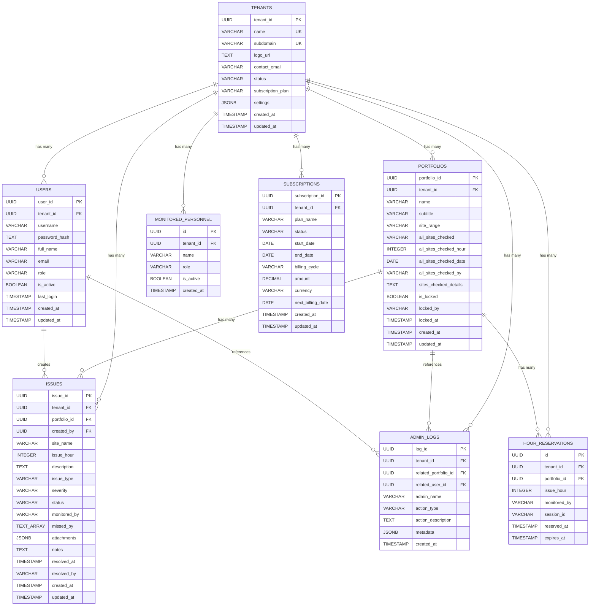

# Entity-Relationship Diagram (ERD)
## Multi-Tenant Portfolio Issue Tracking System

### Visual ER Diagram (Mermaid)

---

## Entity Descriptions

### 1. TENANTS (Core Entity)
**Purpose**: Represents companies/clients using the system
- **Primary Key**: `tenant_id` (UUID)
- **Unique Constraints**: `name`, `subdomain`
- **Relationships**: 
  - One-to-Many with USERS
  - One-to-Many with PORTFOLIOS
  - One-to-Many with ISSUES
  - One-to-Many with all other tables

### 2. USERS
**Purpose**: Authentication accounts for system users
- **Primary Key**: `user_id` (UUID)
- **Foreign Key**: `tenant_id` → TENANTS
- **Unique Constraints**: `(tenant_id, username)`, `(tenant_id, email)`
- **Roles**: `super_admin`, `tenant_admin`, `user`
- **Relationships**:
  - Many-to-One with TENANTS
  - One-to-Many with ISSUES (created_by)

### 3. PORTFOLIOS
**Purpose**: Portfolio/project records belonging to tenants
- **Primary Key**: `portfolio_id` (UUID)
- **Foreign Key**: `tenant_id` → TENANTS
- **Unique Constraints**: `(tenant_id, name)`
- **Relationships**:
  - Many-to-One with TENANTS
  - One-to-Many with ISSUES
  - One-to-Many with HOUR_RESERVATIONS

### 4. ISSUES
**Purpose**: Issue/ticket records for tracking problems
- **Primary Key**: `issue_id` (UUID)
- **Foreign Keys**: 
  - `tenant_id` → TENANTS
  - `portfolio_id` → PORTFOLIOS
  - `created_by` → USERS
- **Relationships**:
  - Many-to-One with TENANTS
  - Many-to-One with PORTFOLIOS
  - Many-to-One with USERS (creator)

### 5. HOUR_RESERVATIONS
**Purpose**: Portfolio locking system for hourly issue tracking
- **Primary Key**: `id` (UUID)
- **Foreign Keys**: 
  - `tenant_id` → TENANTS
  - `portfolio_id` → PORTFOLIOS
- **Unique Constraints**: `(tenant_id, portfolio_id, issue_hour)`
- **Purpose**: Prevents multiple users from logging issues for the same hour

### 6. ADMIN_LOGS
**Purpose**: Audit trail for admin actions
- **Primary Key**: `log_id` (UUID)
- **Foreign Keys**: 
  - `tenant_id` → TENANTS
  - `related_portfolio_id` → PORTFOLIOS (nullable)
  - `related_user_id` → USERS (nullable)
- **Purpose**: Tracks all admin activities for compliance

### 7. MONITORED_PERSONNEL
**Purpose**: List of personnel who monitor sites
- **Primary Key**: `id` (UUID)
- **Foreign Key**: `tenant_id` → TENANTS
- **Unique Constraints**: `(tenant_id, name)`
- **Purpose**: Dropdown list for assigning monitors to issues

### 8. SUBSCRIPTIONS
**Purpose**: Billing and subscription management
- **Primary Key**: `subscription_id` (UUID)
- **Foreign Key**: `tenant_id` → TENANTS
- **Purpose**: Track tenant subscription plans and billing

---

## Relationship Summary

| Relationship | Type | Description |
|-------------|------|-------------|
| TENANTS → USERS | 1:N | One tenant has many users |
| TENANTS → PORTFOLIOS | 1:N | One tenant has many portfolios |
| TENANTS → ISSUES | 1:N | One tenant has many issues |
| TENANTS → HOUR_RESERVATIONS | 1:N | One tenant has many hour reservations |
| TENANTS → ADMIN_LOGS | 1:N | One tenant has many admin logs |
| TENANTS → MONITORED_PERSONNEL | 1:N | One tenant has many monitored personnel |
| TENANTS → SUBSCRIPTIONS | 1:N | One tenant has one subscription |
| PORTFOLIOS → ISSUES | 1:N | One portfolio has many issues |
| PORTFOLIOS → HOUR_RESERVATIONS | 1:N | One portfolio has many hour reservations |
| USERS → ISSUES | 1:N | One user creates many issues |
| PORTFOLIOS → ADMIN_LOGS | 1:N | One portfolio can be referenced in many logs |
| USERS → ADMIN_LOGS | 1:N | One user can be referenced in many logs |

---

## Key Constraints

### Multi-Tenant Isolation
- **All tables** have `tenant_id` foreign key (except TENANTS itself)
- **Row Level Security (RLS)** enforced on all tables
- **Unique constraints** include `tenant_id` to allow same names across tenants
- **Cascade deletes**: Deleting a tenant removes all related data

### Data Integrity
- **Portfolio names** must be unique within a tenant
- **Username/Email** must be unique within a tenant
- **Hour reservations** prevent duplicate hour assignments per portfolio
- **Issue hours** must be between 0-23 (24-hour format)

---

## Indexes

### Performance Indexes
- `idx_users_tenant_id` - Fast user lookup by tenant
- `idx_portfolios_tenant_id` - Fast portfolio lookup by tenant
- `idx_issues_tenant_id` - Fast issue lookup by tenant
- `idx_issues_portfolio_id` - Fast issue lookup by portfolio
- `idx_issues_issue_hour` - Fast filtering by hour
- `idx_issues_status` - Fast filtering by status
- `idx_reservations_expires_at` - Cleanup expired reservations

---

## Notes

1. **Multi-Tenancy**: Every table (except TENANTS) includes `tenant_id` for complete data isolation
2. **Cascade Deletes**: When a tenant is deleted, all related data is automatically removed
3. **Soft Deletes**: Consider adding `deleted_at` columns if soft delete functionality is needed
4. **Audit Trail**: ADMIN_LOGS table tracks all admin actions for compliance
5. **Locking System**: HOUR_RESERVATIONS prevents conflicts when multiple users work on same portfolio/hour

